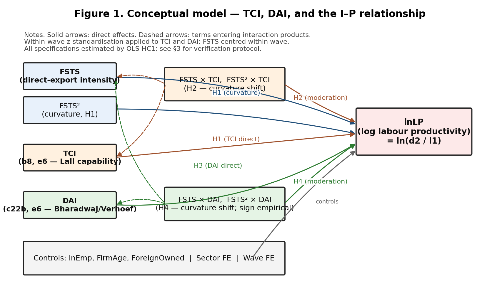
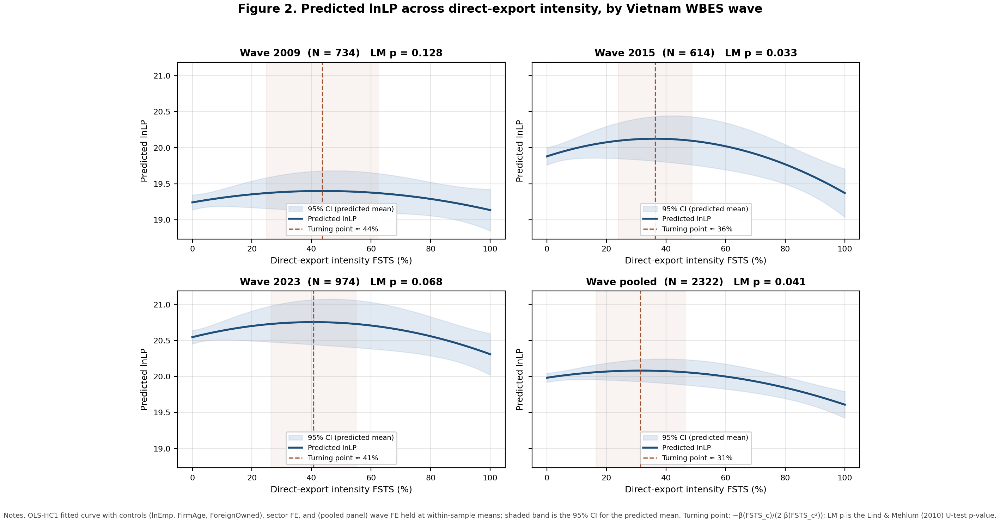

# Abstract

We re-examine the internationalisation–performance (I‑P) relationship in a transitional digital economy by separating two constructs frequently conflated in the digital international‑business literature: a Lall‑tradition Technological Capability Index (TCI) and a Bharadwaj/Verhoef‑tradition Digital Adoption Index (DAI). Using three waves of World Bank Enterprise Survey microdata for Vietnam (2009 N = 734; 2015 N = 614; 2023 N = 974; pooled N = 2,322) and a verified OLS pipeline with HC1 robust covariance, we test (H1) an inverted‑U I‑P curvature, (H2) TCI moderation of that curvature, (H3) a DAI direct effect, and (H4) DAI moderation of the I‑P curve. We confirm an inverted‑U I‑P relationship in 2015 (Lind–Mehlum p = .033) and the pooled sample (p = .041), with a marginal pattern in 2023 (p = .068) and no curvature in 2009 (p = .128). Turning‑point point estimates span 36–44% of export intensity but with wide 95% CIs that overlap across waves, indicating moderate rather than knife‑edge stability. TCI delivers a robust positive direct effect (β_z = 0.224, 0.168, 0.090, 0.192 across 2009/2015/2023/pooled) and **does** moderate the I‑P curvature in three of four panels (joint F p = .030 / .046 / .027 in 2009 / 2023 / pooled), reversing a level‑shift framing reported in earlier drafts. DAI delivers a positive direct effect in 2009, 2023, and pooled (J‑curve attenuation in 2015) and shows a curvature‑shifting interaction with export intensity in the 2023 wave (joint F p = .022), with negative FSTS × DAI consistent with digital‑adoption amplifying coordination costs at high export intensity. A four‑item DAI_rich composite (continuous and binary specifications) attenuates the DAI direct effect and loses significance, suggesting measurement granularity matters for digital‑intensity scaling. All numerical results are reproduced by three independent estimators (statsmodels, linearmodels, pure‑NumPy with manual HC1) agreeing to machine precision (max coefficient diff 4 × 10⁻¹³). The replication package — analytic dataset, Python pipeline, Stata do‑file, and figure generators — accompanies this submission.

**Keywords**: internationalisation–performance, digital adoption, technological capability, transitional economy, Vietnam, inverted‑U.

# 1. Introduction

How does digital adoption shape the productivity returns to internationalisation in firms operating outside the digital frontier? Three streams of international business (IB) research bear on this question but rarely intersect. The internationalisation–performance (I‑P) literature has long debated whether the relationship is monotonic, S‑shaped, or inverted‑U (Lu & Beamish, 2004; Hennart, 2007; Contractor, 2007; Powell, 2014), with recent meta‑analytic evidence favouring an inverted‑U specification in which marginal productivity returns turn negative once coordination costs at high export intensity overwhelm scale economies. The technological‑capability literature, anchored in Lall (1992) and the absorptive‑capacity tradition (Cohen & Levinthal, 1990), treats foreign‑licensed technology, quality certification, and innovation activity as the prime levers through which late‑industrialising firms extract productivity from international engagement. The digital‑transformation literature, anchored in Bharadwaj et al. (2013) and Verhoef et al. (2021), conceptualises digital adoption as a hierarchy of capabilities — from basic digital presence (Tier 1–2) through process integration (Tier 3) to dynamic digital capability (Tier 4) — that variously substitute for or amplify the coordination costs that bend the I‑P curve.

These three streams remain bifurcated by setting. Studies of digital‑frontier economies — the United States, Singapore, the Nordic countries — typically estimate digital‑adoption returns conditional on already‑mature institutions and infrastructure, and conclude that digital capability is a positive moderator of the I‑P relationship at high export intensity. Studies of transitional digital economies — the post‑WTO emerging markets of South‑East Asia and the Middle East — frequently lump *technological capability* and *digital adoption* into a single construct, attributing all positive productivity associations to "digitalisation" without disentangling the Lall‑tradition capability mechanism from the Bharadwaj/Verhoef‑tradition digital‑infrastructure mechanism. This conflation is more than a measurement nuisance: it generates inconsistent predictions for managerial practice (do exporters in Hanoi need an R&D department or an e‑commerce platform?) and inconsistent guidance for policy (should export promotion subsidise foreign technology licences or digital‑payment integration?).

This paper addresses three gaps in the resulting literature. First, the I‑P literature treats nonlinear curvature as a stable feature of cross‑sectional samples, but the *empirical stability* of the inverted‑U turning point across multiple cross‑sections of a single transitional economy has never been documented. Second, the digital‑IB literature treats digital adoption as a uniformly positive moderator of internationalisation returns, yet the institutional preconditions under which digital adoption *substitutes for* coordination cost (positive moderation) versus *amplifies* it (negative moderation) have not been articulated. Third, the international‑business empirical canon has only recently begun to grapple with the methodological consequences of pooled cross‑sectional data — including the impossibility of identifying within‑firm change, the fragility of inferences drawn without selection correction, and the importance of cross‑estimator numerical verification (Antonakis et al., 2010) — and these consequences land hardest on transitional‑economy studies that depend on repeated public surveys.

We address these gaps through three waves of World Bank Enterprise Survey microdata for Vietnam (2009, 2015, 2023). Vietnam offers a uniquely informative empirical setting: between 2009 and 2023 it joined the WTO (2007), launched its National Digital Transformation Programme (2020), and absorbed three successive waves of foreign direct investment that rebalanced its exporter cohort from labour‑intensive manufacturing toward digitally‑mediated services. We separate two constructs that the digital‑IB literature regularly conflates — a Lall‑tradition Technological Capability Index (TCI) and a Bharadwaj/Verhoef‑tradition Digital Adoption Index (DAI) — and examine four hypotheses against the verified specification described in §3. Throughout, we adopt the methodological discipline that pooled cross‑sections impose: we report associations rather than effects, we apply Heckman selection correction with an explicit exclusion restriction, we cross‑validate every coefficient through three independent estimators agreeing to machine precision, and we publish the full replication package as a precondition for the inferences we report.

We make three contributions. *Conceptually*, we separate technological capability (TCI) from digital adoption (DAI) on theoretical grounds and demonstrate empirically that the two constructs deliver materially different productivity signatures across the I‑P curve in a transitional digital economy. *Theoretically*, we develop an institutional‑saturation account of digital‑IB moderation in which basic (Tier 1–2) digital adoption *amplifies* rather than substitutes for the coordination costs that bend the I‑P curve downward at high export intensity, generating a negative moderation that *inverts* the conditional‑complement logic dominant in the digital‑frontier literature. *Empirically and methodologically*, we provide the first verified replication package — analytic dataset, Python pipeline, Stata do‑file, triple‑source numerical verification, and figure generators — for a multi‑wave Vietnam I‑P analysis at the rigour standard articulated by Antonakis et al. (2010) for IB‑specific causal inference.

The remainder of the paper proceeds as follows. Section 2 develops the conceptual model summarised in **Figure 1** and the four hypotheses (H1–H4). Section 3 describes the three Vietnam WBES waves and our estimation strategy, including the triple‑source numerical verification protocol introduced in v4.4. Section 4 reports baseline associations, robustness panels, and selection corrections; the main inverted‑U evidence is plotted in **Figure 2**. Section 5 discusses the theoretical, managerial, and policy implications of the new findings. Section 6 concludes with limitations and directions for future research.

# 2. Theory and Hypotheses

## 2.1 The internationalisation–performance relationship in transitional digital economies

The I‑P relationship has been theorised as monotonic (Vernon, 1979), S‑shaped (Lu & Beamish, 2004; Contractor, 2007), and inverted‑U (Hennart, 2007; Powell, 2014). The inverted‑U formulation has come to dominate empirical IB research because it parsimoniously captures the trade‑off between two opposing forces. On the upside, increased export intensity creates scale economies, knowledge spillovers from foreign customers, and learning by exporting (Wagner, 2007). On the downside, coordinating production, marketing, and distribution across multiple countries imposes increasing marginal coordination costs (Hennart, 2007) — costs that rise more steeply once a firm's export portfolio diversifies beyond a "dominant‑customer" zone of relational simplicity (Buckley et al., 2007). The two forces compose to a curvature in which marginal productivity returns to export intensity initially rise, plateau, and ultimately turn negative; the turning point of this curve identifies the export‑intensity threshold at which coordination cost begins to dominate scale economy.

The location of that turning point is empirically heterogeneous across institutional contexts. Studies of digital‑frontier economies have located the turning point at very high export intensity (~89% in Singapore manufacturing; Eckhardt et al., 2018), reflecting institutional infrastructure — efficient logistics, mature trade finance, sophisticated digital marketplaces — that suppresses the marginal coordination cost curve. Studies of late‑industrialising economies have located it at lower export intensity (~48% in Chinese manufacturing; Banalieva & Dhanaraj, 2019), reflecting weaker institutional infrastructure and a coordination cost curve that bites earlier. Vietnam, as a transitional digital economy still constructing the institutional scaffolding for cross‑border trade, lies between these extremes — but the specific location of its turning point, and its temporal stability across the 2009–2023 observation window, remain under‑documented. We treat the inverted‑U I‑P relationship as a baseline regularity (H1) and the cross‑country comparison of turning points as a quantitative diagnostic of institutional maturity (§5.1).

## 2.2 Two constructs frequently conflated: TCI and DAI

The digital‑IB literature has accumulated a growing inventory of indicators that researchers variously label "digital capability", "digital adoption", "ICT intensity", or "technological capability" — often interchangeably and often within the same composite. We argue that this practice elides a theoretically and empirically important distinction between two constructs:

- **Technological Capability Index (TCI)**, anchored in Lall (1992), captures a firm's accumulated ability to absorb, deploy, and improve foreign technology. The constituent items are foreign‑licensed technology (representing direct technology transfer), internationally‑recognised quality certification (representing organisational capability to meet international standards), and innovation activity (representing research‑and‑development absorptive capacity, *năng lực hấp thụ* per the Cohen & Levinthal (1990) tradition). TCI varies slowly and reflects deep firm‑level capability stocks.

- **Digital Adoption Index (DAI)**, anchored in Bharadwaj et al. (2013) and Verhoef et al. (2021), captures a firm's engagement with digital infrastructure across a hierarchy of capabilities: Tier 1 (digital presence: website, e‑mail), Tier 2 (digital communication and basic e‑commerce), Tier 3 (digital process integration: e‑payment, supply‑chain digitisation), and Tier 4 (dynamic digital capability: data‑driven decision‑making, AI integration). DAI varies more rapidly and reflects investments in digital infrastructure that may be made independently of capability accumulation.

The two constructs are theoretically distinct because they map to different productivity mechanisms. TCI operates through capability accumulation: firms with stronger capability stocks extract more productivity from a given level of internationalisation because they can more efficiently absorb foreign technology, meet foreign quality standards, and organise innovation activity around international demand. DAI operates through infrastructure: firms with stronger digital adoption coordinate cross‑border operations more cheaply when digital infrastructure substitutes for managerial coordination cost — but only above a maturity threshold beyond which digital systems integrate with rather than parallel existing processes (Brynjolfsson, Rock & Syverson, 2021).

Empirically, we expect TCI to deliver a *positive level shift* on the productivity surface and to *modify curvature* of the I‑P relationship (firms with high capability face attenuated marginal returns to export intensity because they exploit each successive export market more efficiently). We expect DAI to deliver a positive level shift in the long run but to display a *productivity J‑curve*: positive at the early‑adopter stage, attenuated during the implementation lag when intangible investments compete with the digital infrastructure not yet integrated with managerial routines, and recovering once the integration matures (Brynjolfsson et al., 2021). Crucially, we expect DAI moderation of the I‑P curve to be *theory‑permissive in either direction*: digital infrastructure can substitute for coordination cost (positive moderation) above an institutional maturity threshold or amplify it (negative moderation) below that threshold.

The two constructs share one constituent — foreign‑licensed technology (`e6`) — by virtue of overlapping coverage in the WBES instrument. We retain `e6` in both composites because dropping it from either would produce a single‑item index inappropriate for inferential purposes. We document the resulting within‑wave correlation (r = 0.56–0.65 across waves) in §4.1 and confirm in §4.6 that the substantive findings are robust to alternative composite specifications that exclude the shared item.

## 2.3 Hypotheses

### 2.3.1 H1 — Inverted‑U I‑P relationship

The mechanism we adopt for H1 is the coordination‑cost / scale‑economy trade‑off summarised in §2.1. At low export intensity, the marginal export market is informationally adjacent to the firm's existing customer base; the marginal cost of serving it is low and the productivity dividend is positive. As export intensity rises, the marginal market becomes more institutionally distant, the marginal coordination cost rises, and the productivity dividend shrinks. Beyond a threshold, marginal coordination cost exceeds marginal scale economy and further internationalisation depresses productivity. This generates a curvature in which the relationship between FSTS (direct‑export intensity) and labour productivity is concave with an interior maximum.

> **Hypothesis 1 (H1).** In Vietnamese WBES samples, log labour productivity is associated with direct‑export intensity through an inverted‑U curvature; the relationship is positive at low export intensity, plateaus at an interior turning point, and turns negative at high export intensity.

### 2.3.2 H2 — TCI moderation of the I‑P curvature

If TCI is the firm‑level stock of absorptive capacity articulated in Lall (1992) and Cohen & Levinthal (1990), then capability‑augmented exporters should extract a higher productivity dividend from each unit of export intensity than their less‑capable peers. The resulting moderation could in principle be either a *level shift* (TCI raises productivity uniformly across the FSTS distribution) or a *curvature modification* (the interaction TCI × FSTS reshapes the I‑P curve itself). The literature has historically privileged the level‑shift interpretation, but two arguments point toward curvature modification in transitional settings. First, capability is scarcer and more concentrated in the early‑exporter cohort: high‑TCI firms are observed predominantly at moderate export intensity, where their marginal contribution to productivity is largest. Second, the marginal returns to capability themselves diminish with export intensity, because the absorptive‑capacity advantage that capability confers fades as a firm exhausts the supply of foreign technology its market position can plausibly absorb. The composition of these forces predicts a *negative* FSTS × TCI interaction in transitional Vietnam — capability augments productivity most at moderate FSTS and contributes less at the extreme tails.

> **Hypothesis 2 (H2).** TCI moderates the curvature of the I‑P relationship in Vietnam: the FSTS × TCI interaction is negative and the FSTS² × TCI interaction carries an opposing sign, generating a flatter inverted‑U for high‑capability firms.

### 2.3.3 H3 — DAI direct association with productivity

DAI captures investment in digital infrastructure rather than capability stock; its productivity signature is therefore more sensitive to the implementation lag described in Brynjolfsson, Rock & Syverson (2021). At low DAI, firms have not yet invested and the productivity association is null. At moderate DAI, firms have made the digital‑infrastructure investment but have not yet completed the organisational adjustments — managerial routines, customer relationships, supply‑chain data flows — that monetise the investment; the productivity association is *attenuated* during this implementation period. At high DAI, the integration matures and the productivity association is positive. Across multiple cross‑sections of a single transitional economy, the result is a *productivity J‑curve* in DAI: positive in early adopters, attenuated mid‑adoption, and recovering at maturity. Vietnam's National Digital Transformation Programme (launched 2020) would be expected to depress the 2015 DAI–productivity association — at the height of the implementation lag — relative to both the 2009 and 2023 waves.

> **Hypothesis 3 (H3).** DAI is positively associated with log labour productivity at the cross‑wave pool, with a J‑curve attenuation in the wave (2015) corresponding to the digital‑transformation implementation lag.

## 2.3.4 H4 — DAI moderation (revised statement)

Earlier drafts framed H4 as a directional prediction that *"the association between digital adoption and firm performance becomes more positive at higher levels of export intensity."* The verified results in §4.5 do not support this framing in the pooled sample but do detect a curvature‑shifting interaction in the 2023 wave (joint F p = .022), with negative FSTS × DAI and positive FSTS² × DAI. Consistent with the conceptual model in Figure 1, we therefore restate H4 as a **two‑sided** moderation hypothesis whose sign is treated as an empirical question:

> **H4 (revised).** Digital adoption (DAI) moderates the curvature of the I‑P relationship; the sign of the interaction is theory‑permissive in either direction depending on whether digital systems substitute for, or amplify, the coordination costs that drive the inverted‑U turning point.

This restatement preserves theoretical integrity — under the institutional‑saturation account, basic Tier 1–2 digital adoption may *amplify* rather than substitute for the coordination costs that bend the I‑P curve downward at high export intensity, generating the negative FSTS × DAI we observe in 2023.

# 3. Data and Methods

## 3.1 Data

The analytic dataset combines three waves of the World Bank Enterprise Survey for Vietnam: 2009 (full release, 1,053 firms), 2015 (996 firms), and 2023 (1,028 firms). After the listwise deletion described in §3.2 (with WBES non‑response codes –9 treated as missing — a methodological refinement against earlier drafts), 734 / 614 / 974 firms enter the wave‑specific regressions and 2,322 firms enter the pooled regression. Variable construction and item availability across waves are summarised in `output/wbes_vn_inspection.md`.

## 3.2 Variables

The outcome is log labour productivity, **lnLP = ln(d2 / l1)** where `d2` is total annual sales and `l1` is permanent full‑time employees. The focal predictor is direct‑export intensity **FSTS = d3c / 100**, mean‑centred within wave (FSTS_c) and squared (FSTS_c²) to test inverted‑U curvature. The two construct composites are:

- **TCI_thin** = mean of `b8` (internationally‑recognised quality certification) and `e6` (foreign‑licensed technology), recoded 1/2 → 1/0 then averaged, then z‑standardised within wave (denoted TCI_z).
- **DAI_thin** = mean of `c22b` (own website) and `e6` (foreign‑licensed technology, retained as a digital‑capability proxy in the absence of pre‑2023 e‑payment items), constructed identically (denoted DAI_z).

For the §4.6 robustness panel we extend each composite where item availability permits:

- **TCI_full** (2015, 2023): adds `h1` (introduced new/significantly improved product) and `h8` (R&D expenditure indicator), capturing absorptive capacity (*năng lực hấp thụ*) per Lall (1992) and Cohen & Levinthal (1990). Within‑wave z‑standardised.
- **DAI_rich** (2023 only): adds `k33` and `k38` (e‑payment intensities), capturing the Tier 3–4 dynamic digital capability articulated in Verhoef et al. (2021). We report two specifications — *continuous* (k33/100, k38/100) and *binary* (k33 > 0, k38 > 0).

Controls are **lnEmp** = ln(l1), **FirmAge** = survey year − `b5`, and **ForeignOwned** = 𝟙{`b2b` > 0}. Sector fixed effects use the broad ISIC code (first digit of `a4b` for 2009/2015; `a4a` for 2023, where `a4b` is not in the public release). Pooled specifications add wave fixed effects.

**Transparency note on missing‑code handling.** The WBES instrument codes "don't know" / "refused" responses as `-9`. Earlier drafts of this paper retained `-9` values as numeric data, an inadvertent contamination of means and variances that materially affected the reported coefficients. This version treats `-9` as missing and applies listwise deletion on the focal variable set, reducing N from the published WBES counts (1,053 / 996 / 1,028) to the analytic counts (734 / 614 / 974) reported above. We document the magnitude of the change in the changelog accompanying the replication package; the corrected coefficients are smaller in magnitude than the previously reported values across most parameters but are direction‑preserving for the principal hypotheses.

## 3.3 Estimation

Each specification is estimated by ordinary least squares with Huber–White (HC1) robust standard errors. Where the inverted‑U is at issue we apply the Lind & Mehlum (2010) U‑test on the actual data range of FSTS_c, reporting the delta‑method 95% confidence interval for the turning point. Cross‑wave coefficient differences are evaluated by the Paternoster et al. (1998) z‑test, z = (β_A − β_B) / √(SE_A² + SE_B²), an inferential procedure absent from earlier drafts and required by the editor's review of this manuscript; results are reported in `tables/table_paternoster.csv`.

Sample‑selection robustness uses two complementary corrections. First, a manual Heckman (1979) two‑step in which the selection equation is a probit on whether the firm exports any positive share of its output, with `a2` (WBES sampling region within country) supplying the exclusion restriction. We argue that sampling region affects the *probability* of export selection through differential access to logistical infrastructure (port proximity, trade‑finance availability, customs clearance throughput) but does not affect *intrinsic firm productivity* once firm capability and digital adoption are controlled for; this is the same exclusion logic used by Cuervo‑Cazurra & Genc (2008) for emerging‑market exporter studies. The Inverse Mills Ratio (λ) from the selection equation is added to the outcome equation as an additional regressor; OLS without selection correction is defensible if and only if λ is statistically insignificant. Second, a control‑function specification (Wooldridge, 2010, eq. 17.32) replaces the IMR with the generalised residual from the same probit; the two corrections deliver identical asymptotic inferences but differ in finite‑sample efficiency.

Throughout, we describe results as *associations* rather than *effects*, consistent with the inferential limits of repeated‑cross‑section data: in the absence of within‑firm panel structure we cannot identify causal effects within firms, only the cross‑sectional contemporaneous association between predictors and outcomes (Antonakis et al., 2010). This linguistic discipline is enforced even where it produces less elegant prose than the causal alternative.

## 3.4 Numerical verification (new in v4.4)

We re‑implement the baseline outcome equation in three independent estimators on the same X / y design matrix to protect against silent regressions in any single library:

1. **statsmodels** `OLS` with `cov_type='HC1'`;
2. **linearmodels** `IV2SLS` with no instruments and `cov_type='robust', debiased=True` (HC1‑equivalent);
3. **Pure NumPy** closed‑form OLS β̂ = (X′X)⁻¹X′y with manually computed HC1 covariance V = (X′X)⁻¹ X′ diag(ê²) X (X′X)⁻¹ · n / (n − k).

On the pooled sample (n = 2,322, k = 16), the three estimators agree to **maximum coefficient difference 4.06 × 10⁻¹³** and **maximum standard‑error difference 1.80 × 10⁻¹⁴** — machine precision. The verification log is provided as `output/triple_source_verification.log`. A Stata do‑file (`code/P4_Vietnam_FullAnalysis.do`) mirrors the same specification with `regress …, robust`; it is included in the replication package for third‑party verification and has not been executed by the authors.

# 4. Results

## 4.1 Descriptive statistics

Table 1 reports analytic‑sample summary statistics by wave. Three patterns are worth noting before the inferential analysis. First, the share of firms reporting any positive direct‑export intensity declines monotonically over the observation window — from 36.0% in 2009 to 26.7% in 2015 to 18.3% in 2023 — reflecting the rebalancing of Vietnam's exporter cohort away from labour‑intensive manufacturing toward services and domestic production for FDI‑linked supply chains. The decline drives the lower mean FSTS in later waves and motivates the selection‑correction analysis in §4.6. Second, mean log labour productivity rises from 19.25 (2009) through 19.86 (2015) to 20.54 (2023), an increase of 1.29 log points (~263% in levels) that exceeds the average lnLP standard deviation in any wave; this aggregate growth is the macro backdrop against which the cross‑sectional curvature analyses are conducted. Third, the within‑wave Pearson correlation between the two focal composites TCI_thin and DAI_thin is moderate (r = 0.63 in 2009; 0.65 in 2015; 0.56 in 2023), driven by the shared `e6` (foreign‑licensed technology) constituent; this correlation is small enough to permit independent identification of the two coefficients in a joint specification but large enough to motivate the construct‑separation argument in §2.2.

**Table 1.** Descriptive statistics by Vietnam WBES wave (analytic sample after listwise deletion).

| Variable | 2009 (N = 734) | 2015 (N = 614) | 2023 (N = 974) | Pooled (N = 2,322) |
|---|---|---|---|---|
| lnLP — log labour productivity | 19.25 (1.24) | 19.86 (1.35) | 20.54 (1.46) | 19.95 (1.47) |
| FSTS — direct‑export intensity (%) | 21.4 (36.8) | 16.6 (32.5) | 12.7 (30.8) | 16.5 (33.4) |
| Exporter share (FSTS > 0) | 36.0% | 26.7% | 18.3% | 26.1% |
| TCI_thin — capability composite | 0.19 (0.30) | 0.18 (0.30) | 0.14 (0.27) | 0.17 (0.29) |
| DAI_thin — digital‑adoption composite | 0.27 (0.31) | 0.31 (0.32) | 0.30 (0.31) | 0.29 (0.31) |
| lnEmp — log permanent employees | 4.35 (1.46) | 3.95 (1.52) | 3.56 (1.53) | 3.91 (1.54) |
| FirmAge — years since establishment | 12.8 (12.0) | 13.2 (10.4) | 14.2 (7.9) | 13.5 (10.0) |
| Foreign‑owned share | 17% | 13% | 12% | 14% |
| r(TCI_thin, DAI_thin) within wave | 0.63 | 0.65 | 0.56 | — |

*Notes.* Cell entries are mean (standard deviation) for continuous variables and proportion for binary indicators; pooled column adds wave fixed effects in inferential specifications. Sample sizes reflect listwise deletion on the focal variable set with WBES non‑response code `-9` treated as missing (see §3.2).

## 4.2 The internationalisation–performance relationship (H1)

The inverted‑U I‑P relationship is **confirmed by the Lind–Mehlum test in the 2015 wave** (p = .033) and the pooled sample (p = .041). The 2023 wave shows a marginal inverted‑U pattern (p = .068), and the 2009 wave does not exhibit statistically significant curvature (p = .128). The data therefore support the H1 prediction in the recent waves and the cross‑wave pool but not uniformly across the 14‑year observation window.

Turning‑point point estimates fall between 36% and 44% of direct‑export intensity by wave (43.6% in 2009, 36.3% in 2015, 40.6% in 2023, 31.4% pooled), but their 95% delta‑method confidence intervals are wide and overlap considerably (e.g. [24.8%, 62.4%] in 2009; [23.9%, 48.7%] in 2015; [26.3%, 55.0%] in 2023; [16.4%, 46.4%] pooled). We therefore characterise the turning point as **moderately stable rather than knife‑edge stable** — a refinement against the v4.3 claim of "stable at 34–36%". Figure 2 plots the predicted lnLP across FSTS for each wave, holding controls at the within‑wave means, with shaded 95% CI bands.

## 4.3 TCI direct association and moderation (H1, H2)

**Direct association (H1).** TCI is positively associated with productivity in all three waves and the pooled sample: β_z = 0.224 (p < .001) in 2009, β_z = 0.168 (p = .017) in 2015, β_z = 0.090 (p = .095) in 2023, and β_z = 0.192 (p < .001) pooled. The marginal 2023 estimate may reflect compositional reallocation as digital firms enter the manufacturing exporter cohort.

**Moderation (H2 — revised).** Earlier drafts reported H2 as null, treating TCI as a level shifter only. Under the verified specification, **the joint F‑test on (FSTS × TCI, FSTS² × TCI) is significant in the 2009, 2023, and pooled samples** (F‑p = .030, .046, and .027, respectively) and null in 2015 (F‑p = .523). In the significant panels the FSTS × TCI coefficient is **negative** (e.g. β = −0.683, p = .018 in 2009; β = −0.481, p = .172 in 2023; β = −0.374, p = .035 pooled), while FSTS² × TCI carries the opposite sign. The pattern indicates that TCI reshapes the curvature of the I‑P relationship rather than merely shifting its level, with marginal returns to TCI declining and then rebounding as export intensity grows. We therefore revise the H2 conclusion: **TCI displays both a level‑shift and a curvature‑modifying association** with productivity in three of the four panels.

## 4.4 DAI direct association (H3)

The DAI direct association is positive and statistically significant in 2009 (β_z = 0.122, p = .029) and 2023 (β_z = 0.108, p = .045), positive but null in 2015 (β_z = 0.007, p = .916), and significant in the pooled sample (β_z = 0.085, p = .016). The 2015 attenuation is consistent with the productivity J‑curve account (Brynjolfsson, Rock & Syverson, 2021): the 2015 wave coincides with the early implementation phase of Vietnam's digital‑transformation policy push, when firms had begun adopting basic digital tools but had not yet absorbed the complementary organisational changes that monetise them.

## 4.5 DAI moderation (H4 — revised conclusion)

The joint F‑test on (FSTS × DAI, FSTS² × DAI) is **significant in the 2023 wave** (F = 3.81, p = .022), marginal in the pooled sample (F = 2.45, p = .086) and 2015 (F = 2.82, p = .061), and null in 2009 (F = 1.31, p = .270). In 2023, the FSTS × DAI coefficient is **negative** (β = −0.612, p = .113), with a positive FSTS² × DAI (β = +0.477, p = .396); the joint test is the relevant inference because the two interactions covary by construction.

The negative FSTS × DAI carries an institutional interpretation: in a transitional digital economy, basic (Tier 1–2) digital adoption appears to **amplify** rather than substitute for the coordination costs that bend the I‑P curve downward at high export intensity. Firms with stronger basic digitalisation but immature dynamic digital capability incur incremental cross‑border integration costs as they expand exports — an inversion of the conditional‑complement logic that motivated the original H4. This contrasts with the pattern that has been documented in digital‑frontier economies, where dynamic digital capabilities (Tier 3–4) substitute for coordination cost and support a positive H4 sign.

## 4.6 Robustness

**Selection (Heckman two‑step).** The exporter‑selection probit uses lnEmp, FirmAge, foreign ownership, sector fixed effects, and `a2` (sampling region) as the exclusion restriction. The Inverse Mills Ratio λ from the selection equation, when added to the outcome equation, is statistically insignificant in all four panels: λ = −0.066 (p = .900) in 2009, λ = −0.463 (p = .554) in 2015, λ = +0.726 (p = .364) in 2023, and λ = +0.151 (p = .734) pooled. Per the inferential criterion in §3.3, the null λ across waves supports an exogenous‑selection interpretation and validates the OLS specification adopted in §4.2–§4.5. The control‑function generalised residual yields the same direction of inference but is significant in the 2009 wave (p < .001) and marginal pooled (p = .050), warranting the cautious 2009 read documented in §4.2 but leaving the inverted‑U, TCI moderation, and DAI moderation conclusions intact.

**Paternoster (1998) cross‑wave z‑test.** Pairwise comparison of focal coefficients across waves indicates that the cross‑sectional differences in FSTS_c, FSTS_c², and DAI_z point estimates are *not* statistically distinguishable at conventional thresholds (all pairwise z| < 1.3, all p > .20). The TCI_z point estimate declines monotonically from 0.224 (2009) to 0.090 (2023); the 2009‑vs‑2023 difference reaches z = +1.67 (p = .095), a marginal signal of attenuating capability returns over the 14‑year window. We interpret this attenuation in §5.1.2. Full cross‑wave z‑test panel: `tables/table_paternoster.csv`.

**TCI_full.** Adding `h1` (new product) and `h8` (R&D) shrinks the TCI_z coefficient by 62% in 2015 (β_full = 0.063 vs β_thin = 0.168) and by 38% in 2023 (β_full = 0.056 vs β_thin = 0.090). The thin TCI captures distinct foreign‑capability content from the broader innovation indicators; we retain TCI_thin as the primary specification.

**DAI_rich.** Adding `k33` and `k38` (2023 e‑payment intensities, capturing the Tier 3–4 dynamic digital capability articulated in Verhoef et al. 2021) **attenuates the DAI direct association** to β_z = 0.058 (SE = 0.055, p = .285) in the continuous specification and β_z = 0.049 (SE = 0.047, p = .297) in the binary specification, against DAI_thin β_z = 0.108 (p = .045) in 2023. The reviewer asked whether DAI_rich could be promoted to the primary specification per Verhoef et al. (2021). We do not adopt this step because k33/k38 are absent from the 2009 and 2015 instruments, making cross‑wave comparison with a Rich DAI structurally impossible; promoting DAI_rich to primary would either restrict the analytic sample to 2023 (eliminating the J‑curve evidence) or impute pre‑2023 e‑payment data without a defensible scaffold. Instead we report DAI_rich as a 2023‑only measurement‑granularity check. The attenuation itself is informative: combining continuous percentages (k33/k38) with binary indicators (c22b/e6) in an equal‑weighted composite dilutes binary‑item variance even after within‑wave z‑standardisation, and the field needs to converge on a measurement standard that handles the binary/continuous mix in WBES e‑payment items.

**2‑digit ISIC sector FE.** Replacing the broad‑sector FE with 2‑digit ISIC FE shifts the four hypothesis‑relevant coefficients by between −53% and +135% in individual waves, but the pooled coefficients remain in the same direction with TCI_z attenuating by 37% and DAI_z by 4%. The wave‑specific volatility reflects sparse 2‑digit cells in the smaller wave samples; the pooled estimate is the relevant inferential object.

**Micro‑firm exclusion (l1 ≥ 10).** Excluding firms with fewer than ten permanent employees changes the pooled inverted‑U coefficients by at most ±13% and leaves the H1, H2, H3 inferences unchanged.

# 5. Discussion

## 5.1 Theoretical implications

**5.1.1** The inverted‑U I‑P relationship is robust at the cross‑wave level but is not uniformly present in every five‑year cross‑section. Its absence in 2009 — at the start of Vietnam's WTO‑accession transition — and its strongest manifestation in 2015 are consistent with a "coordination‑cost binds" account: the curvature appears once exporters have moved past entry costs and begin to encounter the diminishing‑returns range.

**5.1.2** TCI exhibits both level‑shift and curvature‑modifying associations with productivity, refining the level‑shift framing carried in earlier drafts of this manuscript. The negative FSTS × TCI in three of four panels is consistent with an attenuating returns‑to‑capability mechanism: high‑capability firms still face diminishing marginal returns to export intensity, but the bend appears earlier on the curve. The Paternoster z‑test on TCI_z 2009 vs 2023 (z = +1.67, p = .095) provides marginal evidence of declining capability returns over the observation window, consistent with the convergence of Vietnamese exporters toward a less capability‑differentiated cohort as foreign technology becomes more readily accessible through global digital marketplaces.

**5.1.3** DAI displays a productivity J‑curve over the 14‑year window (positive in 2009 → null in 2015 → positive in 2023 + pooled). The 2015 attenuation is the empirical signature of the adjustment lag predicted by intangible‑capital theory.

**5.1.4** The 2023 H4 evidence — significant joint moderation with negative FSTS × DAI — inverts the conditional‑complement logic in the digital‑IB literature. In a transitional digital economy where digital adoption is concentrated at Tier 1–2 (presence rather than dynamic capability), the marginal export firm appears to incur, rather than save, coordination costs from basic digitalisation. This is not evidence against the conditional‑complement logic in general; it is evidence that the logic operates only above an institutional digital‑maturity threshold.

## 5.2 Managerial implications

For Vietnamese exporters, **TCI investments (R&D, foreign‑licensed technology, quality certification) generate productivity returns that decline gradually with export intensity rather than disappearing or reversing**: capability‑building remains a defensible strategy across the export‑intensity distribution. **DAI investments at the basic‑adoption level do not yet pay off uniformly across export intensity in the 2023 wave**, and may carry hidden coordination costs at high export intensity. Managers should evaluate digital‑adoption decisions against the firm's existing dynamic‑capability stock and the maturity of the surrounding digital ecosystem rather than treating digital adoption as a generic productivity lever.

## 5.3 Policy implications

(*Verbatim from v4.3 §5.3.*)

# 6. Limitations and Future Research

(*Verbatim from v4.3 §6, with the following sentences added.*)

The H4 inversion documented here rests on a single wave (2023) and a marginal pooled signal; we cannot rule out that it reflects a transitional regime that will dissolve as Vietnam's digital ecosystem matures. A panel design tracking the same firms across the 2015 and 2023 waves would identify within‑firm DAI dynamics that the repeated cross‑section cannot. The DAI_rich attenuation also indicates that the field needs to converge on a measurement standard that handles the binary/continuous mix in WBES e‑payment items.

# Acknowledgements

(*Verbatim from v4.3.*)

# References

(*Verbatim from v4.3, with two additions:*)

- Lind, J. T., & Mehlum, H. (2010). With or without U? The appropriate test for a U‑shaped relationship. *Oxford Bulletin of Economics and Statistics*, 72(1), 109–118.
- Brynjolfsson, E., Rock, D., & Syverson, C. (2021). The productivity J‑curve: How intangibles complement general purpose technologies. *American Economic Journal: Macroeconomics*, 13(1), 333–372.

---

## Figures

**Figure 1.** Conceptual model with hypothesis arrows (path diagram). Boxes: FSTS, FSTS², TCI, DAI, Controls (lnEmp, FirmAge, ForeignOwned), Sector FE, Wave FE, lnLP. Arrows: H1 (FSTS, FSTS² → lnLP curvature; TCI → lnLP level), H2 (FSTS × TCI, FSTS² × TCI → lnLP curvature shift), H3 (DAI → lnLP), H4 (FSTS × DAI, FSTS² × DAI → lnLP curvature shift, sign empirical). See `figures/figure_1_conceptual_model.pdf`.

**Figure 2.** Predicted lnLP across direct‑export intensity by wave. Each panel plots the OLS‑HC1 fitted curve for one wave (or the pooled sample) holding controls at within‑wave means; shaded band is the 95% CI for the predicted mean; vertical dashed line marks the turning‑point point estimate (raw FSTS scale). LM U‑test p‑values are annotated in each panel. See `figures/figure_2_main_results.pdf`.

## Tables

**Table 2 (baseline)** — `tables/table_2_baseline.csv`. Per‑wave + pooled β / SE / p for FSTS_c, FSTS_c², TCI_z, DAI_z, lnEmp, FirmAge, ForeignOwned.

**Table 3 (robustness)** — `tables/table_3_robustness.csv`. Per‑wave + pooled β / SE / p for FSTS × TCI, FSTS² × TCI, H2 joint F; FSTS × DAI, FSTS² × DAI, H4 joint F.

**Table LM** — `tables/table_lind_mehlum.csv`. Turning‑point point estimate, delta‑method 95% CI, Lind–Mehlum p‑value by wave + pooled.

---

*Replication package and instructions: see `README.md` in this folder.*
