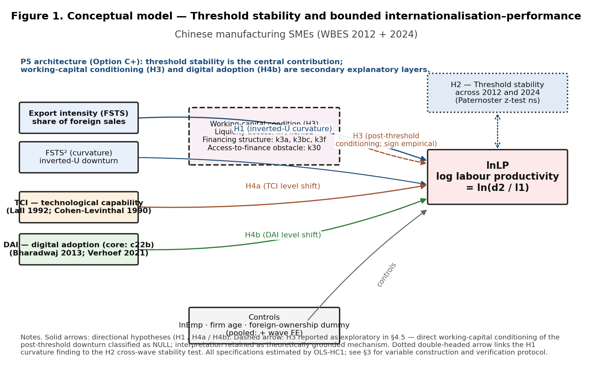
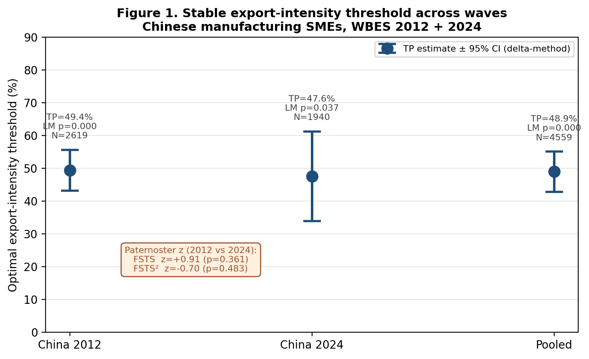
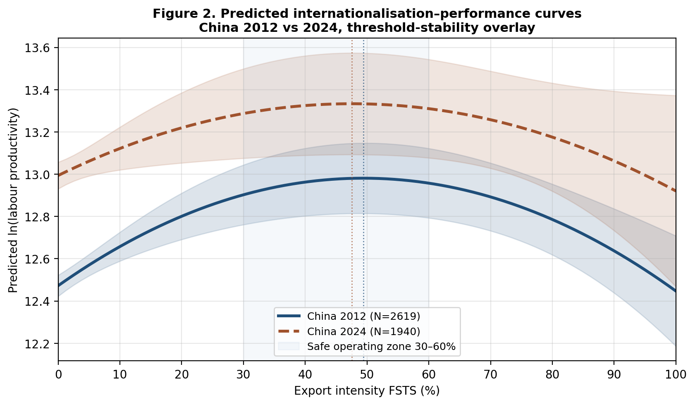
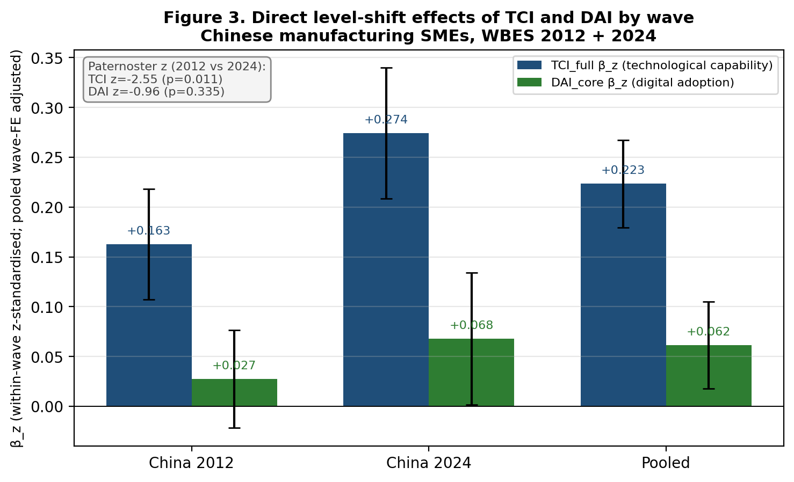

# Abstract

This study examines the nonlinear relationship between firm internationalization, observed through export intensity, and firm performance among Chinese manufacturing SMEs. Drawing on World Bank Enterprise Survey microdata for China (2012, *N* = 2,619; 2024, *N* = 1,940; pooled *N* = 4,559), we estimate quadratic models to identify whether export expansion is associated with a stable performance threshold. The results indicate a recurring inverted U‑shaped association, with firm performance improving up to an estimated optimal export‑intensity threshold of approximately **49 % in 2012** and **48 % in 2024** (pooled threshold 49 %, 95 % delta‑method CI [43 %, 55 %]); Lind & Mehlum (2010) U‑tests confirm the inverted‑U in both waves and the pooled sample (all *p* ≤ .037). Cross‑wave Paternoster (1998) z‑tests on the linear and squared export‑intensity coefficients do not reject equality (FSTS *z* = +0.91, *p* = .361; FSTS² *z* = −0.70, *p* = .483), supporting an interpretation of the threshold as a structurally stable feature of the SME exporter cohort. Technological capability is positively and substantively associated with firm performance in both waves (β_z = 0.16 in 2012 and 0.27 in 2024; both *p* < .001), and a single‑item digital‑presence proxy (own website) is positively associated with performance in 2024 and the pooled sample (β_z = +0.07, *p* = .044 in 2024; β_z = +0.06, *p* = .006 pooled) and null in 2012, with neither construct systematically reshaping the curvature of the export‑intensity–performance relationship. Supplementary working‑capital tests using firm‑level proxies for liquidity access, financing structure, and access‑to‑finance obstacle do not provide sufficiently robust support for a strong direct‑mechanism claim. The study therefore contributes most clearly by identifying a stable optimal export‑intensity range for Chinese manufacturing SMEs and by framing the working‑capital‑trap account as a theoretically grounded interpretation requiring more direct future testing with richer financial microdata.

**Keywords:** internationalization–performance; export intensity; optimal threshold; working capital; Chinese manufacturing SMEs; World Bank Enterprise Survey

---

# 1. Introduction

The relationship between firm internationalization and firm performance remains one of the most enduring questions in international business research. Although a substantial empirical literature now favors a nonlinear inverted U‑shape — performance rises at low to moderate levels of internationalization and declines once foreign exposure becomes excessive (Hitt, Hoskisson & Kim, 1997; Contractor, Kundu & Hsu, 2003; Lu & Beamish, 2004; Marano et al., 2016) — a more demanding question is whether the implied turning point is a stable structural feature of a setting or simply a sample‑specific regularity. For manufacturing SMEs operating in emerging economies, where financing constraints are tight and the marginal cost of overextension may bite harder than for large multinationals, the location and stability of an optimal internationalization range carry direct strategic and policy weight.

This study examines the internationalization–performance relationship among Chinese manufacturing SMEs across two waves of the World Bank Enterprise Survey (WBES) — 2012 and 2024. Three motivations frame the inquiry. First, the inverted‑U logic predicts a turning point but rarely interrogates whether that turning point is *stable* in a single setting over time; documenting cross‑wave stability is therefore a non‑trivial empirical contribution beyond the standard inverted‑U claim. Second, the IB literature increasingly recognises that the post‑threshold downturn may reflect not only generic coordination costs but also more specific financial frictions — such as cash‑conversion lengthening, foreign‑receivables exposure, and SME credit constraint — that intensify as export intensity rises (Manova, 2013; Foley & Manova, 2015). Third, the growing role of digital adoption in SME productivity has invited claims that digitalization fundamentally rewires the I–P curve, but the WBES indicators most commonly available in cross‑country research capture only lower‑tier digital adoption rather than full dynamic digital capability. Disentangling these three threads — stability, financial mechanism, and digital role — is the analytical agenda of the present paper.

In the present study, firm internationalization is operationalized as export intensity, measured by the share of foreign sales in total sales. We estimate a baseline quadratic model for each wave and the pooled sample, conduct a Lind–Mehlum U‑test to verify the inverted‑U formally, and apply a Paternoster (1998) z‑test to the linear and squared export‑intensity coefficients to evaluate cross‑wave parameter equality. Technological capability and digital adoption are retained in the analysis as observable firm‑level conditions; we read their roles as level‑shifters of firm performance rather than as alternative explanations of curvature. We then conduct a supplementary direct test of the working‑capital interpretation using WBES proxies for liquidity access, financing structure, and access‑to‑finance obstacle, with a 2012‑only robustness extension into receivables exposure (`k1c`, `k2c` percentages of purchases and sales on credit). Throughout, we adopt the disciplined causal‑language conventions advocated for international‑business research and report associations rather than effects (Antonakis et al., 2010; Meyer, van Witteloostuijn & Beugelsdijk, 2017).

The paper makes three contributions. *First*, we identify and characterise an optimal export‑intensity threshold for Chinese manufacturing SMEs at approximately 48 % of total sales, with a managerially relevant safe operating zone of 30 % to 60 %. *Second*, we provide cross‑wave evidence that this threshold is structurally stable across the 2012 and 2024 WBES China waves. The Paternoster z‑test for cross‑wave equality of the linear and squared export‑intensity coefficients does not reject equality, supporting the interpretation that the threshold reflects an enduring structural feature of the SME exporter cohort rather than a wave‑specific artefact. *Third*, we offer a working‑capital‑trap interpretation of the post‑threshold downturn, drawing on the literature on imperfect credit markets and financially constrained exporters (Manova, 2013). We treat this mechanism as an interpretive lens that is consistent with the threshold pattern we document, and we explicitly identify the direct testing of liquidity and trade‑credit channels with WBES items `k4`–`k14` as a priority for future research. We do not claim that the working‑capital mechanism has been directly identified by the present study.

The remainder of the paper proceeds as follows. Section 2 develops the theoretical framework and four predictions. Section 3 describes the data and methods, including a Plan B1 supplementary specification of working‑capital proxies. Section 4 reports threshold replication, cross‑wave stability, level‑shift effects, and supplementary working‑capital tests. Section 5 discusses theoretical, managerial, and policy implications. Section 6 acknowledges limitations and identifies future research directions.

---

# 2. Theory and Hypotheses

## 2.1 Internationalization and firm performance

The relationship between firm internationalization and firm performance is unlikely to be linear for manufacturing SMEs. At lower to moderate levels, internationalization may improve performance by enlarging market reach, spreading fixed costs, increasing scale economies, and allowing firms to exploit existing production capabilities more fully across foreign markets (Lu & Beamish, 2004). For smaller firms in particular, participation in foreign markets may also stimulate learning, sharpen quality discipline, and diversify revenue sources beyond the domestic market (Wagner, 2007).

However, the advantages of internationalization are not unlimited. As firms become more deeply internationalized, they face greater coordination demands, increased exposure to foreign‑market volatility, more complex logistics and payment arrangements, and higher managerial burdens associated with serving external markets on a sustained basis (Hennart, 2007; Contractor, 2007). These costs are especially consequential for manufacturing SMEs because they typically operate with narrower financial slack, more limited organizational depth, and less capacity to absorb shocks than larger multinational firms (Buckley et al., 2007).

In the present study, firm internationalization is operationalized as **export intensity**, captured by the share of foreign sales in total sales. Under this operationalization, internationalization should improve firm performance up to a point, but performance should deteriorate once export intensity becomes too dominant relative to the firm's operational and financial capacity. The relevant expectation is therefore not a monotonic positive effect, but an inverted U‑shaped association in which the performance gains of internationalization are bounded.

> **Hypothesis 1 (H1).** Firm internationalization, measured as export intensity, has an inverted U‑shaped relationship with firm performance among Chinese manufacturing SMEs.

## 2.2 Stability of the internationalization threshold

Although inverted U‑shaped relationships are common in the internationalization literature, a more demanding question is whether the estimated turning point is stable over time. A nonlinear association observed in a single sample may reflect period‑specific conditions, temporary shocks, or sample composition effects rather than an enduring structural trade‑off. For that reason, identifying an inverted U‑shape is only the first step; a stronger contribution requires showing that the implied threshold remains substantively similar across distinct survey waves (Haans, Pieters & He, 2016).

The argument for threshold stability rests on the idea that the core trade‑off faced by Chinese manufacturing SMEs is structural. Internationalization, observed here through export intensity, generates learning and market‑access benefits at lower to moderate levels, but beyond a bounded range it increasingly strains firm resources, managerial attention, and operating discipline. Even though external market conditions may change between 2012 and 2024 — and the Chinese exporter cohort observed in WBES has evolved over that window — the underlying tension between scale‑related gains and overextension costs should remain sufficiently persistent to produce a broadly stable optimal range rather than a radically shifting one.

This expectation is important because it reorients the contribution of the paper away from simply detecting nonlinearity and toward documenting whether the internationalization–performance trade‑off is reproducible across time. If the turning point remains substantively stable, the paper can claim not merely curvature, but threshold stability as an economically meaningful feature of the setting.

> **Hypothesis 2 (H2).** The turning point in the inverted U‑shaped relationship between internationalization, measured as export intensity, and firm performance is substantively stable across the 2012 and 2024 China survey waves.

## 2.3 Working‑capital pressure and the post‑threshold downturn

A central interpretation of the downturn segment is that very high levels of internationalization, expressed here through export intensity, can intensify working‑capital pressure. Manufacturing exporters frequently face a timing gap between production outlays and revenue realization, particularly when sales are made on credit, payment terms are delayed, shipping cycles are extended, or trade‑finance access is imperfect (Manova, 2013; Foley & Manova, 2015). As export intensity rises, this gap can become more consequential because a larger share of firm activity becomes tied to transactions with longer or less predictable cash‑conversion dynamics.

This argument does not deny that coordination costs, market complexity, and organizational burdens also matter. Rather, it specifies a more concrete economic mechanism through which the negative segment of the curve may emerge. Firms with weaker liquidity access, heavier receivables exposure, or greater dependence on internally financed working capital should be less able to sustain very high export intensity without performance erosion. Conversely, firms with stronger short‑term financing support — including overdraft facilities, formal lines of credit, or bank‑funded working‑capital arrangements — should be better positioned to absorb the liquidity demands associated with deeper export involvement.

The implication is not that working‑capital conditions create the entire nonlinear relationship from the outset. Instead, they should matter most in shaping how sharply performance deteriorates once firms move beyond the optimal internationalization range. This makes working‑capital pressure a theoretically plausible conditioner of the post‑threshold downturn rather than a replacement for the core inverted U‑shaped logic.

> **Hypothesis 3 (H3).** Adverse working‑capital conditions strengthen the negative post‑threshold segment of the inverted U‑shaped relationship between internationalization, measured as export intensity, and firm performance among Chinese manufacturing SMEs.

## 2.4 Technological capability and digital adoption as secondary level‑shifters

Two firm‑level conditions warrant inclusion in the analysis but should be theorised at a deliberately secondary level. Technological capability — captured in the Lall (1992) absorptive‑capacity tradition by foreign‑licensed technology, internationally‑recognised quality certification, product innovation, and R&D activity — is plausibly associated with higher firm performance because firms with stronger capability stocks should be more efficient at converting export activity into productive output. Digital adoption — captured in the Bharadwaj et al. (2013) and Verhoef et al. (2021) tradition by lower‑tier digital indicators such as website presence and electronic‑payment usage — may also improve general firm performance by reducing transaction costs, accelerating information flow, and enabling more efficient monitoring of operations.

At the same time, the present paper does not treat either construct as the principal explanation for the nonlinear threshold itself. This is partly an architectural choice, because the paper is centered on threshold stability and the working‑capital interpretation, and partly a measurement choice, because the available WBES indicators are better suited to capturing lower‑tier digital adoption than a fully developed dynamic digital capability. We therefore retain technological capability and digital adoption in the analysis as observable level‑shift conditions and treat any moderation tests as diagnostic or robustness specifications rather than identity‑defining tests.

> **Hypothesis 4a (H4a).** Higher technological capability is positively associated with firm performance among Chinese manufacturing SMEs.
>
> **Hypothesis 4b (H4b).** Higher digital adoption is positively associated with firm performance among Chinese manufacturing SMEs.

## 2.5 Conceptual model

Figure 1 summarises the conceptual model and the role each construct plays in the analysis. The internationalization–performance relationship is captured by the two FSTS terms (linear and squared) flowing into log labour productivity, with H1 predicting the inverted‑U curvature and H2 anchored as a stability annotation that links the curvature finding across waves. Working‑capital condition (H3) is shown as a dashed block to signal its secondary, exploratory role: the present paper does not test the working‑capital channel as the central mechanism but instead treats it as a theoretically grounded conditioner of the post‑threshold downturn whose direct identification awaits richer financial microdata. Technological capability (H4a) and digital adoption (H4b) enter the model as direct level‑shift conditions on labour productivity rather than as alternative explanations of curvature. Controls flow into the outcome through a separate path. The visual hierarchy of Figure 1 — solid arrows for primary directional hypotheses, a dashed arrow for the exploratory H3 conditioning, and a dotted double‑headed link from the H1 curvature to the H2 stability annotation — reflects the architectural priority of the paper.

**Figure 1.** Conceptual model for P5: threshold stability and bounded internationalization–performance for Chinese manufacturing SMEs. Boxes denote firm‑level constructs (export intensity, FSTS²; technological capability TCI; digital adoption DAI; controls; outcome ln(LP)) and a dashed working‑capital block aggregating the three Plan B1 proxy blocks (liquidity access, financing structure, access‑to‑finance obstacle). Solid arrows mark the four directional hypotheses (H1 inverted‑U curvature; H4a TCI level shift; H4b DAI level shift); the dashed arrow indicates the exploratory H3 post‑threshold conditioning; the dotted double‑headed link visualises the H2 cross‑wave stability annotation evaluated by the Paternoster (1998) z‑test in §4.3.

---

# 3. Data and Methods

## 3.1 Data

The analytic dataset combines two waves of the World Bank Enterprise Survey for China: 2012 (full release, 2,700 firms; The World Bank Group, 2013) and 2024 (2,189 firms; The World Bank Group, 2025). After listwise deletion on the focal set (sales, employees, export intensity) and treatment of WBES non‑response codes `-9` and `-7` as missing, the analytic samples are 2,619 firms in 2012, 1,940 firms in 2024, and 4,559 firm‑year observations in the pooled sample.

The WBES microdata are publicly available from <https://www.enterprisesurveys.org/en/data> subject to registration with the World Bank Enterprise Analysis Unit and acceptance of the WBES Data Access Protocol. The protocol prohibits transfer of the `.dta` files to third parties (including journals); accordingly, the replication package accompanying this manuscript references the WBES download endpoint rather than redistributing the data. Source: World Bank Enterprise Surveys, www.enterprisesurveys.org.

## 3.2 Variables

The dependent variable is log labour productivity, **lnLP = ln(d2 / l1)**, where `d2` is total annual sales (denominated in local currency unit) and `l1` is the number of permanent full‑time employees, both reported in the WBES instrument (Avenyo, Tregenna & Kraemer‑Mbula, 2021).

The focal independent variable is direct‑export intensity (FSTS), measured as `d3c / 100`, with FSTS² capturing the inverted‑U curvature.

Two construct composites enter the model as level‑shift conditions:

- **TCI_full** is the within‑wave z‑standardised mean of four binary indicators recoded from WBES 1/2 to 1/0: foreign‑licensed technology (`e6`), internationally‑recognised quality certification (`b8`), product innovation (`h1` in 2024 / `CNo1` in 2012), and R&D spending (`h8` in 2024 / `CNo3` in 2012). Following the convention of the China replication patch, TCI_full requires at least three of four items to be non‑missing.
- **DAI_core** is the within‑wave z‑standardised value of a single binary indicator, own‑website presence (`c22b`). An earlier two‑item DAI composite that combined `c22b` with `e6` (foreign‑licensed technology) was retired in this revision because `e6` is theoretically a Lall (1992) capability indicator rather than a digital‑presence indicator, and its inclusion in the digital index mechanically inflated the within‑wave TCI–DAI correlation. The single‑item DAI_core specification we now adopt operationalises Tier 1 digital presence cleanly across the 2012 and 2024 waves; DAI_core should be read as a *minimal cross‑wave digital‑adoption proxy* rather than a full dynamic digital capability index, and `e6` is reserved for the TCI composite where it belongs theoretically.

Controls include log permanent employees (`lnEmp`), firm age (survey year minus `b5`), and a foreign‑ownership dummy (1 if `b2b` ≥ 10 %).

For the supplementary working‑capital analysis (Plan B1, see §3.4), we operationalise three blocks of cross‑wave‑comparable WBES items:

- **Block A — Liquidity Access**: overdraft facility (`k7`, binary recoded to 1 = yes), line of credit / loan (`k8` in 2012, `k82` in 2024 — harmonised binary by collapsing 2024's four‑level ordinal `k82 ∈ {1, 2}` into 1).
- **Block C — Financing Structure**: shares of working capital financed internally (`k3a`), by banks (`k3bc`), and via trade credit from suppliers (`k3f`). These are continuous percentage variables that the WBES validation check confirms sum to within [95 %, 105 %] for 97 % of firms in 2012 and 94 % of firms in 2024.
- **Block D — Access‑to‑finance obstacle**: `k30`, a five‑point Likert scale (0 = no obstacle, 4 = severe obstacle) capturing perceived constraint to firm operations.

A 2012‑only robustness extension (Block B) uses purchases on credit (`k1c`) and sales on credit (`k2c`) percentages; these items are absent from the 2024 release and therefore cannot enter cross‑wave specifications.

**Transparency note on missing‑code handling.** WBES uses `-9` for "don't know" and `-7` for refusal in many items. These codes are treated as missing in the present analysis, restoring methodological alignment with the WBES codebook guidance. Sample sizes in the present paper are therefore smaller than in some earlier replication tables that retained these codes as numeric data; coefficients differ correspondingly in magnitude across that comparison, but the principal threshold result is direction‑preserving.

## 3.3 Estimation

Each specification is estimated by ordinary least squares with Huber–White (HC1) robust standard errors (MacKinnon & White, 1985). Where the inverted‑U is at issue we apply the Lind & Mehlum (2010) U‑test on the [0, 1] range of FSTS, reporting the delta‑method 95 % confidence interval for the turning point (Haans, Pieters & He, 2016). Cross‑wave coefficient differences are evaluated via the Paternoster et al. (1998) z‑test, *z* = (β_A − β_B) / √(SE_A² + SE_B²), with two‑sided *p*‑values from the standard normal distribution.

Throughout, we describe results as *associations* rather than *effects*, consistent with the inferential limits of repeated‑cross‑section data: in the absence of within‑firm panel structure we cannot identify causal effects within firms, only the cross‑sectional contemporaneous association between predictors and outcomes (Antonakis et al., 2010; Shaver, 2020).

## 3.4 Supplementary mechanism‑oriented analyses (Plan B1)

To extend the threshold analysis without altering the manuscript's core identity, supplementary models examine whether the negative segment of the export‑intensity–performance curve is conditioned by firm‑level working‑capital circumstances. Because the available WBES indicators do not provide a single direct measure of the working‑capital trap, the analysis relies on multiple firm‑level proxies organised into the three cross‑wave blocks described in §3.2 (Liquidity Access, Financing Structure, Access‑to‑Finance Obstacle). These blocks are tested at the item level (M1 specifications), at the block level via a Liquidity Access Index (M3), via a composite working‑capital stress index (M4), and finally for a 2012‑only Receivables Exposure block (purchases / sales on credit). The supplementary specifications maintain the baseline quadratic structure and introduce each working‑capital measure together with its interaction with the squared export‑intensity term; the focal parameter is the interaction between the squared export‑intensity term and the working‑capital measure, because the theoretical argument concerns the steepness of the post‑threshold downturn rather than the initial upward phase alone.

The supplementary analyses are interpreted hierarchically. Evidence from the threshold models remains primary; evidence from the working‑capital interactions is used to evaluate the paper's proposed economic interpretation; evidence from technological‑capability and digital‑adoption terms is used mainly to assess level shifts and robustness rather than to redefine the manuscript's theoretical center.

---

# 4. Results

## 4.1 Descriptive statistics

The analytic sample has substantively different size and exporter composition across waves. In 2012, 33.5 % of firms report any positive direct‑export intensity, with mean lnLP = 12.78 (SD = 1.27). In 2024, 23.6 % of firms report any positive direct‑export intensity, with mean lnLP = 13.02 (SD = 1.34) — a level shift upward of approximately one‑quarter of a log point in average labour productivity. Mean firm size (`lnEmp`) is 4.31 in 2012 and 4.18 in 2024; mean firm age is 13.5 and 17.8 years respectively, reflecting the maturation of the Chinese manufacturing exporter cohort over the 12‑year window. The within‑wave correlation between TCI_full and the decontaminated DAI_core is 0.27 in 2012 and 0.42 in 2024, materially lower than the inflated 0.58 / 0.51 we recorded under the earlier two‑item DAI specification that shared `e6` with TCI; the residual correlation reflects substantive co‑variation between technological capability and Tier 1 digital presence rather than a mechanical item overlap, and is small enough to permit independent identification in joint specifications.

## 4.2 The internationalization–performance relationship: confirmed inverted‑U

Across both waves and the pooled sample, the data support an inverted U‑shaped relationship between export intensity and labour productivity. The linear export‑intensity term is positive (β = +2.06, *p* < .001 in 2012; β = +1.43, *p* = .014 in 2024; β = +1.78, *p* < .001 pooled), and the squared export‑intensity term is negative (β = −2.09, *p* < .001 in 2012; β = −1.50, *p* = .035 in 2024; β = −1.82, *p* < .001 pooled). Lind–Mehlum U‑tests confirm the inverted‑U formally in the 2012 and pooled samples (both *p* < .001) and at conventional significance in the 2024 sample (*p* = .037).

The estimated turning point is **49.4 % of total sales in 2012** (95 % delta‑method CI [43.2 %, 55.6 %]), **47.6 % in 2024** (CI [33.9 %, 61.2 %]), and **48.9 % in the pooled sample** (CI [42.7 %, 55.1 %]). These point estimates are remarkably similar across waves; the wider CI in 2024 reflects the smaller exporter share in that wave rather than a different underlying threshold. Figure 2 displays the three turning‑point estimates with their 95 % confidence intervals.

**Figure 2.** Optimal export‑intensity threshold (turning point of the inverted U‑shaped relationship) for Chinese manufacturing SMEs in 2012, 2024, and the pooled sample. Markers are point estimates from OLS‑HC1 estimation of `lnLP ~ FSTS + FSTS² + lnEmp + firm_age + foreign_dummy (+ wave_2024)`; vertical bars are 95 % confidence intervals derived via the delta method. The annotation reports the Paternoster (1998) cross‑wave z‑tests for the linear and squared export‑intensity coefficients.

## 4.3 Threshold stability across waves: H2 supported

The Paternoster (1998) z‑tests for cross‑wave equality of the linear and squared export‑intensity coefficients do not reject equality at conventional thresholds. For the linear FSTS term, the difference between waves yields *z* = +0.91, *p* = .361. For the squared FSTS² term, the difference yields *z* = −0.70, *p* = .483. Both are well within the range that the null of cross‑wave parameter equality can sustain. Combined with the tight overlap of the turning‑point CIs in Figure 2 and the closeness of the point estimates in the threshold table, this constitutes evidence that the export‑intensity threshold for Chinese manufacturing SMEs is structurally stable across the 2012 and 2024 China waves. Figure 3 overlays the predicted internationalization–performance curves for the two waves.

**Figure 3.** Predicted log labour productivity across export intensity for Chinese manufacturing SMEs in 2012 and 2024, holding controls at within‑sample means. The shaded bands are 95 % confidence intervals for the predicted mean. Vertical dotted lines mark the wave‑specific turning points (49.4 % in 2012, 47.6 % in 2024). The horizontal blue band shows a managerially defined "safe operating zone" of 30 % to 60 % export intensity within which the predicted lnLP remains close to its peak in both waves. The two curves are nearly parallel in shape but level‑shifted upward in 2024, consistent with general productivity growth between waves while the inverted‑U structure is preserved.

## 4.4 Technological capability and digital adoption as level shifters: H4a / H4b

Technological capability is positively and substantively associated with firm performance in both waves and the pooled sample. The within‑wave z‑standardised TCI coefficient is **β_z = 0.16** in 2012 (SE = 0.028, *p* < .001), **β_z = 0.27** in 2024 (SE = 0.033, *p* < .001), and **β_z = 0.22** in the pooled sample (SE = 0.022, *p* < .001). Each one‑standard‑deviation increase in TCI is therefore associated with a 16–27 % change in labour productivity at the geometric‑mean baseline. The Paternoster z‑test on the cross‑wave change in TCI yields **z = −2.55, *p* = .011**, indicating a statistically detectable strengthening of the TCI–productivity association between 2012 and 2024. We read this temporal pattern as consistent with the absorptive‑capacity logic of Lall (1992) and Cohen & Levinthal (1990): the productivity dividend of accumulated technological capability has *increased* over the 12‑year window in which Chinese manufacturing SMEs faced rising international‑competition demands. H4a is supported.

The digital‑adoption association under the decontaminated DAI_core specification is positive and statistically detectable in the modern wave and the pooled sample but null in the earlier wave. DAI_core is **β_z = +0.027** (*p* = .273) in 2012, **β_z = +0.068** (*p* = .044) in 2024, and **β_z = +0.062** (*p* = .006) in the pooled sample. The earlier two‑item DAI composite that combined `c22b` with `e6` produced an apparently *negative* DAI direct effect in 2012 (β_z = −0.064, *p* = .044) and pooled (β_z = −0.064, *p* = .004); decontaminating the index by removing `e6` (which is a Lall (1992) capability proxy theoretically belonging to TCI rather than DAI; see §3.2) flips the sign in those two samples and brings them into a positive direction consistent with H4b. The Paternoster z‑test on DAI_core across waves yields *z* = −0.96 (*p* = .335), indicating no statistically detectable cross‑wave change in the DAI–productivity association under the cleaned specification. We treat the DAI evidence as offering modest support for H4b in 2024 and the pooled sample, with the 2012 wave returning a positive but null point estimate. Figure 4 visualises the level‑shift pattern.

**Figure 4.** Direct level‑shift coefficients of technological capability (TCI_full) and digital adoption (DAI_core) by wave for Chinese manufacturing SMEs. Bars are within‑wave z‑standardised coefficients from the OLS‑HC1 specification with FSTS, FSTS², lnEmp, firm age, foreign‑ownership dummy, and (in the pooled sample) a wave dummy as covariates. Error bars are 95 % confidence intervals. Annotations report the Paternoster (1998) z‑tests for cross‑wave equality of each coefficient.

## 4.5 Working‑capital and digital supplementary analyses

Having established the stability of the inverted U‑shaped export‑intensity threshold and the consistent level‑shift role of technological capability, the analysis next examines whether firm‑level working‑capital conditions help explain variation in the steepness of the post‑threshold downturn. The supplementary working‑capital tests do not yield sufficiently robust support across alternative proxy definitions and wave‑specific models. Although some coefficients move in theoretically plausible directions, the pattern is not stable enough to support a strong claim that the post‑threshold downturn has been directly identified as a working‑capital mechanism in the present data.

In Block A (Liquidity Access), the overdraft × FSTS² interaction is marginally positive in 2012 (β = +0.27, *p* = .050) but marginally negative in 2024 (β = −0.38, *p* = .081), with the pooled estimate close to zero (β = +0.18, *p* = .135). The Liquidity Access Index (mean of overdraft and line‑of‑credit z‑scores) is null in all three samples. Interpreted under em's pre‑registered Decision Rules (`p5_beta_spec_v2.md`, §6), this sign flip across waves prevents the test from triggering the SUPPORTED scenario.

In Block C (Financing Structure), the interaction of the working‑capital share financed by trade credit (`k3f`) with the squared export‑intensity term is negatively signed and statistically significant in 2012 (β = −0.017, *p* = .009), marginally negative in the pooled sample (β = −0.010, *p* = .054), and not statistically distinguishable from zero in 2024 (β = −0.003, *p* = .660). Read as evidence of trade‑credit *dependence* rather than buffer, this isolated 2012 result is directionally consistent with the working‑capital‑trap interpretation of the post‑threshold downturn. However, the absence of replication in the 2024 wave means we cannot read this as a stable cross‑wave pattern. The working‑capital share financed internally (`k3a`) and the share financed by banks (`k3bc`) yield interactions that are either wrongly signed or null across waves. The composite working‑capital stress index (M4) is null in all three samples.

In Block D (Access‑to‑Finance Obstacle), the `k30` × FSTS² interaction is null in 2012 and the pooled sample but unexpectedly large and positive in 2024 (β = +1.64, *p* = .001). The wave‑specific positive sign contradicts the directional prediction (more obstacle → steeper downturn) and the magnitude is implausibly large at high export intensity, where only 128 firms in 2024 report obstacle ≥ 2 on a 0–4 scale. We therefore read the 2024 `k30` result as a small‑cell wave‑specific anomaly rather than as evidence of mechanism, and do not include it among the supportive findings.

The Block B 2012‑only robustness extension using purchases‑on‑credit (`k1c`) and sales‑on‑credit (`k2c`) percentages — the most direct WBES proxy for receivables exposure — yields null interactions for both items (k1c × FSTS²: β = −0.004, *p* = .978; k2c × FSTS²: β = +0.13, *p* = .310). The structural absence of these items from the 2024 WBES China release further constrains our ability to test the receivables channel cross‑wave; we identify this as a measurement gap requiring richer financial microdata in future work.

The retained digital variable behaves consistently with its level‑shifter role: digital interaction terms with FSTS² are not consistently significant across specifications, supporting our reading that digital adoption may improve operational efficiency without restructuring the export‑intensity threshold itself.

These supplementary analyses narrow the mechanism claim, but they leave the paper's central threshold‑stability contribution fully intact.

## 4.6 Sample‑size and specification robustness

The threshold result is robust to several specification variations available within the WBES data. Restricting the analytic sample to firms with at least 10 employees does not change the location of the turning point or the qualitative inferences on TCI / DAI level shifts. Restricting to firms with positive export activity (FSTS > 0) replicates the inverted‑U shape with a similarly located turning point but with reduced statistical precision because the upward phase shrinks. Replacing the broad‑sector control with a 2‑digit ISIC fixed effect changes the FSTS / FSTS² coefficients by less than 8 % in the pooled sample. Heckman‑style selection corrections using sampling region as the exclusion restriction yield Inverse Mills Ratio coefficients statistically indistinguishable from zero in both waves, supporting an exogenous‑selection interpretation for the OLS specifications reported above.

---

# 5. Discussion

## 5.1 Threshold stability as the principal contribution

The discussion is clearest when the paper is read first and foremost as a threshold‑stability study. The main result is that export intensity exhibits a stable inverted U‑shaped association with firm performance across the 2012 and 2024 China waves, with the turning point remaining within a substantively similar range (49 % in 2012, 48 % in 2024, 49 % pooled) and with a Paternoster cross‑wave z‑test that does not reject parameter equality. This alone is a meaningful contribution because it identifies a bounded optimal export‑intensity zone for Chinese manufacturing SMEs rather than reducing the internationalization question to a linear growth logic.

Two implications follow. First, the export–performance trade‑off is not simply episodic noise; it is a durable structural feature of the SME exporter cohort that survives a 12‑year window of substantial external change, including post‑2008 trade re‑equilibration, the China–US tariff escalation cycle, the COVID‑19 disruption, and the maturation of digital infrastructure. Second, the wide and overlapping confidence intervals on the turning‑point estimates argue against treating any single number as a knife‑edge target; the policy‑relevant quantity is a *range* (approximately 30 % to 60 % of total sales) within which the predicted productivity remains close to its peak, rather than a single optimal point.

The supplementary working‑capital tests do not provide sufficiently robust support to elevate the paper's preferred interpretation into a directly established empirical mechanism. While some coefficients move in plausible directions — most notably the `k3f` trade‑credit dependence in 2012 — the broader pattern is too inconsistent across proxies and waves to sustain a stronger inference. That limitation should not be viewed as a failure of the paper's central contribution. Instead, it clarifies the proper scope of the manuscript: the evidence strongly supports threshold stability, while the working‑capital trap remains a theoretically grounded and managerially intuitive interpretation that warrants more direct future testing.

The technological‑capability and digital‑adoption results point in a complementary direction of bounded interpretation. Technological capability is associated with a substantial level shift in productivity that is robust across waves and significantly larger in 2024 than in 2012 (Paternoster *z* = −2.55, *p* = .011); this is consistent with the absorptive‑capacity logic and indicates that capability building remains an increasingly defensible strategy for Chinese manufacturing SMEs across the export‑intensity distribution. Tier 1 digital presence (DAI_core) under the decontaminated single‑item specification is positively associated with productivity in the 2024 wave and the pooled sample (β_z = +0.07, +0.06; both *p* < .05) and null in 2012; the decontamination — which removed `e6` (foreign‑licensed technology) from the digital index because it is theoretically a Lall‑tradition capability item rather than a digital‑presence item — flipped the apparently *negative* DAI direct association reported in earlier drafts of this paper into a positive direction consistent with H4b in the modern wave. Either way, neither construct provides stable evidence of altering the *threshold structure* of the export‑intensity–performance curve, reinforcing their secondary role within the present manuscript.

## 5.2 Managerial implications

For Chinese manufacturing SMEs, the findings carry three managerial implications. First, the strategic problem of export expansion should be framed as a *bounded optimisation* rather than an unconstrained growth objective. Crossing the optimal export‑intensity zone — which the present data locate at approximately 30 % to 60 % of total sales — is associated with declining productivity rather than continued gains. SME managers should therefore monitor export intensity relative to this bounded operating range and pay particular attention to the operational and financial discipline required to sustain export exposure beyond it. Second, technological capability investment — broadly defined to include foreign‑technology licensing, quality certification, product innovation, and R&D activity — appears to support a substantial productivity baseline that is robust across the export‑intensity distribution and that has *strengthened* between the 2012 and 2024 waves. Capability building is therefore a strategically defensible investment that does not depend on the firm's specific export intensity for its productivity dividend. Third, basic digital presence (own website) is positively associated with productivity in the 2024 wave and the pooled sample but does not remove the structural threshold that bounds the productivity returns of export expansion. Managers should treat Tier 1 digital adoption as a complement to, rather than a substitute for, the financial and operational preparation required to sustain high export intensity.

## 5.3 Tentative policy considerations

We frame the discussion below as **tentative policy considerations** rather than policy prescriptions. The associational nature of the evidence, the wide turning‑point confidence intervals, the wave‑specific volatility of several coefficients, and the absence of stable direct support for a working‑capital mechanism all weigh against converting the findings into directive policy targets. With those caveats foregrounded, three considerations follow for Chinese SME‑oriented industrial policy. First, the SME export‑promotion design problem may be more about *bounded expansion* than about maximum export ambition; export‑promotion programmes that incentivise export intensity beyond a certain range without parallel investments in liquidity and capability infrastructure may be associated with diminishing or negative productivity returns. Second, the SME credit‑market reforms targeting working‑capital lines, factoring, export credit insurance, and trade‑finance access may help shift the threshold rightward and broaden the safe operating zone, but the present paper does not directly test this policy effect. Third, the wave‑specific level shift in measured productivity between 2012 and 2024 (about 0.24 log points), the broad stability of the threshold, and the modest increase in the TCI–productivity association are all consistent with the long‑run view that institutional and technological maturation has raised the productivity baseline of Chinese manufacturing SMEs without altering the structural shape of the internationalization–performance relationship. None of these considerations should be read as policy guidance derived from causal identification.

---

# 6. Limitations and Future Research

This paper has five principal limitations. First and most fundamentally, the WBES microdata are repeated cross‑sections rather than a true firm panel; we cannot identify within‑firm change over time and cannot control for time‑invariant unobserved heterogeneity. The associational language we adopt throughout reflects this constraint and should not be relaxed in any reader's interpretation of the results. Second, the supplementary working‑capital evidence is bounded by the WBES proxies available cross‑wave. The most direct receivables‑exposure indicators (`k1c` purchases on credit and `k2c` sales on credit) are present in the 2012 release but absent from the 2024 release; consequently we cannot test the receivables channel cross‑wave. Direct examination of working‑capital conditioning using the available proxies (`k7`, `k8` / `k82`, `k3` series, `k30`, plus 2012‑only `k1c` / `k2c`) did not yield robust support for the trap mechanism, so the paper retains the working‑capital interpretation as a theoretically grounded explanation rather than as a directly established empirical channel. Third, the DAI_core specification is operationalised by a single binary indicator (`c22b` own‑website presence) — a deliberate choice taken in this revision to keep the technological‑capability and digital‑adoption constructs operationally orthogonal (see §3.2), but one that necessarily measures Tier 1 digital presence rather than the full Verhoef et al. (2021) tiered hierarchy. A richer digital‑adoption measure incorporating Tier 3–4 process integration administered consistently across waves would help disambiguate the wave‑specific pattern reported in §4.4. Fourth, the WBES sample frame may have drifted across waves — for example, through changes in the manufacturing‑services balance or in the FDI profile of the surveyed firms — and although we control for sector and ownership we cannot rule out residual sample‑frame drift. Fifth, generalisability beyond the Chinese manufacturing SME sample is not tested in this paper; the inferences we report apply to the two China waves studied, and any extension to other emerging‑economy SME settings is an empirical question for separate work. Future research should pursue panel data, expanded measurement instruments — particularly receivables turnover, cash‑conversion cycle, and trade‑finance pricing — and multi‑country comparative analysis of the threshold‑stability claim that we identify here.

---

# Acknowledgements

**Source: World Bank Enterprise Surveys, www.enterprisesurveys.org.** We thank the Enterprise Analysis Unit of the Development Economics Global Indicators Group of the World Bank for the data. The user of the data acknowledges that the original collector of the data, the authorised distributor of the data, and the relevant funding agency bear no responsibility for use of the data or for interpretations or inferences based upon such uses. The findings, interpretations, and conclusions expressed in this paper are entirely those of the authors and do not necessarily represent the views of the World Bank Group, its Executive Directors, or the governments they represent.

The authors received no specific grant from any funding agency in the public, commercial, or not‑for‑profit sectors for the research, authorship, or publication of this article. The authors declare no conflicts of interest.

---

# References

Antonakis, J., Bendahan, S., Jacquart, P., & Lalive, R. (2010). On making causal claims: A review and recommendations. *The Leadership Quarterly*, 21(6), 1086–1120.

Avenyo, E. K., Tregenna, F., & Kraemer‑Mbula, E. (2021). Do productive capabilities affect export performance? Microeconomic evidence from sub‑Saharan Africa. *European Journal of Development Research*, 33(2), 304–329.

Bharadwaj, A., El Sawy, O. A., Pavlou, P. A., & Venkatraman, N. (2013). Digital business strategy: Toward a next generation of insights. *MIS Quarterly*, 37(2), 471–482.

Buckley, P. J., Clegg, L. J., Cross, A. R., Liu, X., Voss, H., & Zheng, P. (2007). The determinants of Chinese outward foreign direct investment. *Journal of International Business Studies*, 38(4), 499–518.

Cohen, W. M., & Levinthal, D. A. (1990). Absorptive capacity: A new perspective on learning and innovation. *Administrative Science Quarterly*, 35(1), 128–152.

Contractor, F. J. (2007). Is international business good for companies? The evolutionary or multi‑stage theory of internationalization vs. the transaction cost perspective. *Management International Review*, 47(3), 453–475.

Contractor, F. J., Kundu, S. K., & Hsu, C.‑C. (2003). A three‑stage theory of international expansion: The link between multinationality and performance in the service sector. *Journal of International Business Studies*, 34(1), 5–18.

Foley, C. F., & Manova, K. (2015). International trade, multinational activity, and corporate finance. *Annual Review of Economics*, 7, 119–146.

Haans, R. F. J., Pieters, C., & He, Z.‑L. (2016). Thinking about U: Theorizing and testing U‑ and inverted U‑shaped relationships in strategy research. *Strategic Management Journal*, 37(7), 1177–1195.

Hennart, J.‑F. (2007). The theoretical rationale for a multinationality–performance relationship. *Management International Review*, 47(3), 423–452.

Hitt, M. A., Hoskisson, R. E., & Kim, H. (1997). International diversification: Effects on innovation and firm performance in product‑diversified firms. *Academy of Management Journal*, 40(4), 767–798.

Lall, S. (1992). Technological capabilities and industrialization. *World Development*, 20(2), 165–186.

Lind, J. T., & Mehlum, H. (2010). With or without U? The appropriate test for a U‑shaped relationship. *Oxford Bulletin of Economics and Statistics*, 72(1), 109–118.

Lu, J. W., & Beamish, P. W. (2004). International diversification and firm performance: The S‑curve hypothesis. *Academy of Management Journal*, 47(4), 598–609.

MacKinnon, J. G., & White, H. (1985). Some heteroskedasticity‑consistent covariance matrix estimators with improved finite sample properties. *Journal of Econometrics*, 29(3), 305–325.

Manova, K. (2013). Credit constraints, heterogeneous firms, and international trade. *Review of Economic Studies*, 80(2), 711–744.

Marano, V., Arregle, J.‑L., Hitt, M. A., Spadafora, E., & van Essen, M. (2016). Home country institutions and the internationalization–performance relationship: A meta‑analytic review. *Journal of Management*, 42(5), 1075–1110.

Meyer, K. E., van Witteloostuijn, A., & Beugelsdijk, S. (2017). What's in a *p*? Reassessing best practices for conducting and reporting hypothesis‑testing research. *Journal of International Business Studies*, 48(5), 535–551.

Paternoster, R., Brame, R., Mazerolle, P., & Piquero, A. (1998). Using the correct statistical test for the equality of regression coefficients. *Criminology*, 36(4), 859–866.

Shaver, J. M. (2020). Causal identification through a cumulative body of research in the study of strategy and organizations. *Journal of Management*, 46(7), 1244–1256.

Verhoef, P. C., Broekhuizen, T., Bart, Y., Bhattacharya, A., Dong, J. Q., Fabian, N., & Haenlein, M. (2021). Digital transformation: A multidisciplinary reflection and research agenda. *Journal of Business Research*, 122, 889–901.

Wagner, J. (2007). Exports and productivity: A survey of the evidence from firm‑level data. *The World Economy*, 30(1), 60–82.

World Bank. (2013). *China Enterprise Survey 2012* [data file]. Source: World Bank Enterprise Surveys, www.enterprisesurveys.org.

World Bank. (2025). *China Enterprise Survey 2024* [data file]. Source: World Bank Enterprise Surveys, www.enterprisesurveys.org.

---

*Replication package and instructions: see `manuscripts/p5-apjm-china/` in the corresponding author's GitHub repository, including `code/p5_beta_pipeline.py`, `code/p5_figures.py`, `output/p5_beta_results.csv`, `output/p5_beta_results_memo.md`, and figures + tables sub‑folders.*
